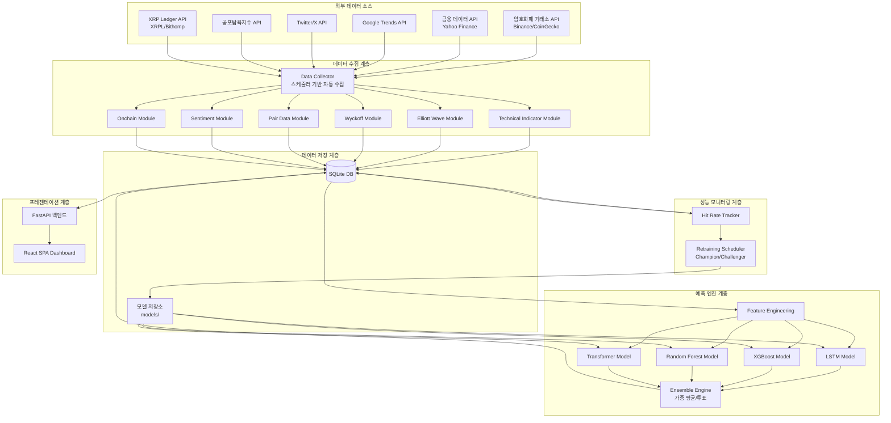
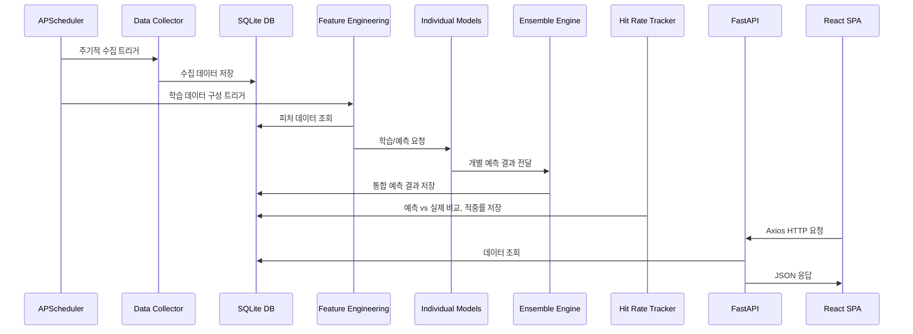

# XRP 가격 예측 대시보드 - 기술 설계 문서

## 개요 (Overview)

XRP 가격 예측 대시보드는 다양한 데이터 소스(기술 지표, 엘리엇 파동, 와이코프 분석, 상관 자산, 시장 심리, 온체인 데이터)를 수집·분석하고, 4개의 독립 ML 모델(LSTM, XGBoost, Random Forest, Transformer)을 앙상블하여 단기/중기/장기 XRP 가격을 예측하는 웹 기반 시스템이다.

시스템은 Python 가상환경(venv) 기반으로 구축하며, 백엔드는 FastAPI, 프론트엔드는 React(JSX) SPA를 사용한다. 데이터 저장은 SQLite(개발/소규모)와 파일 기반 모델 저장소를 사용하고, APScheduler로 데이터 수집 및 재학습을 자동화한다. 프론트엔드와 백엔드는 REST API를 통해 통신하며, 개발 시 Vite 개발 서버의 프록시 설정으로 CORS 문제를 해결한다.

### 기술 스택

| 영역 | 기술 | 비고 |
|------|------|------|
| 언어 | Python 3.11+ | 가상환경(venv) 사용 |
| 백엔드 API | FastAPI | 비동기 지원, 자동 문서화 |
| 프론트엔드 | React 18 (JSX) + Vite | SPA 대시보드, 컴포넌트 기반 UI |
| 차트 라이브러리 | Lightweight Charts (TradingView) + Recharts | 금융 캔들스틱 차트 + 일반 데이터 시각화 |
| HTTP 클라이언트 (FE) | Axios | API 통신, 인터셉터 지원 |
| 상태 관리 | React Query (TanStack Query) | 서버 상태 캐싱, 자동 리페치 |
| 스타일링 | Tailwind CSS | 유틸리티 기반 CSS |
| ML 프레임워크 | PyTorch (LSTM, Transformer), scikit-learn (RF), XGBoost | 모델별 최적 프레임워크 |
| 데이터 처리 | pandas, numpy | 시계열 데이터 처리 |
| 스케줄러 | APScheduler | 데이터 수집/재학습 자동화 |
| DB | SQLite | 경량 관계형 DB |
| HTTP 클라이언트 | httpx | 비동기 API 호출 |
| 테스트 | pytest, hypothesis | 단위/속성 기반 테스트 |

### Python 가상환경 구성 (백엔드)

```bash
# 가상환경 생성
python3.11 -m venv .venv

# 활성화 (Linux/Mac)
source .venv/bin/activate

# 활성화 (Windows)
.venv\Scripts\activate

# 의존성 설치
pip install -r requirements.txt
```

**requirements.txt** 주요 의존성:
```
fastapi>=0.104.0
uvicorn>=0.24.0
pandas>=2.1.0
numpy>=1.25.0
torch>=2.1.0
scikit-learn>=1.3.0
xgboost>=2.0.0
httpx>=0.25.0
apscheduler>=3.10.0
sqlalchemy>=2.0.0
hypothesis>=6.90.0
pytest>=7.4.0
pytrends>=4.9.0
tweepy>=4.14.0
ta>=0.11.0
```

### Node.js 환경 구성 (프론트엔드)

```bash
# Node.js 18+ 필요
node --version  # v18.x 이상 확인

# 프론트엔드 디렉토리 이동 및 의존성 설치
cd frontend
npm install

# 개발 서버 실행
npm run dev
```

**package.json** 주요 의존성:
```json
{
  "dependencies": {
    "react": "^18.2.0",
    "react-dom": "^18.2.0",
    "react-router-dom": "^6.20.0",
    "axios": "^1.6.0",
    "@tanstack/react-query": "^5.8.0",
    "lightweight-charts": "^4.1.0",
    "recharts": "^2.10.0",
    "tailwindcss": "^3.4.0"
  },
  "devDependencies": {
    "@vitejs/plugin-react": "^4.2.0",
    "vite": "^5.0.0",
    "autoprefixer": "^10.4.0",
    "postcss": "^8.4.0"
  }
}
```

## 아키텍처 (Architecture)

### 전체 시스템 구조



### 프로젝트 디렉토리 구조

```
xrp-price-prediction-dashboard/
├── .venv/                          # Python 가상환경
├── requirements.txt                # Python 의존성 목록
├── config.py                       # 전역 설정 (API 키, DB 경로, 스케줄 주기)
├── main.py                         # FastAPI 앱 진입점
├── frontend/                       # React SPA 프론트엔드
│   ├── package.json
│   ├── vite.config.js              # Vite 설정 (프록시 포함)
│   ├── tailwind.config.js
│   ├── index.html
│   ├── public/
│   └── src/
│       ├── main.jsx                # React 앱 진입점
│       ├── App.jsx                 # 라우팅 및 레이아웃
│       ├── api/
│       │   └── client.js           # Axios 인스턴스 및 API 호출 함수
│       ├── hooks/
│       │   └── useQueries.js       # React Query 커스텀 훅
│       ├── components/
│       │   ├── Layout.jsx          # 공통 레이아웃 (사이드바, 헤더)
│       │   ├── PriceOverview.jsx   # 현재 가격, 변동률, 거래량
│       │   ├── CandlestickChart.jsx # TradingView Lightweight Charts 캔들스틱
│       │   ├── TechnicalIndicators.jsx # 기술 지표 오버레이
│       │   ├── ElliottWavePanel.jsx # 엘리엇 파동 분석 패널
│       │   ├── WyckoffPanel.jsx    # 와이코프 분석 패널
│       │   ├── PredictionPanel.jsx # 예측 결과 (개별 모델 + 앙상블)
│       │   ├── CorrelationChart.jsx # 상관 자산 차트
│       │   ├── SentimentGauge.jsx  # 심리 지표 게이지
│       │   ├── OnchainChart.jsx    # 온체인 데이터 차트
│       │   ├── HitRateChart.jsx    # 적중률 시계열 차트
│       │   ├── FeatureImportance.jsx # 피처 기여도 막대 차트
│       │   └── RetrainingHistory.jsx # 재학습 이력 테이블
│       └── pages/
│           ├── Dashboard.jsx       # 메인 대시보드 페이지
│           ├── Analysis.jsx        # 기술 분석 상세 페이지
│           └── Performance.jsx     # 모델 성능 모니터링 페이지
├── db/
│   ├── database.py                 # SQLAlchemy 엔진/세션 설정
│   ├── models.py                   # ORM 모델 정의
│   └── xrp_data.db                 # SQLite DB 파일
├── collectors/
│   ├── base_collector.py           # 수집기 기본 클래스 (재시도, 로깅)
│   ├── price_collector.py          # XRP 가격 데이터 수집
│   ├── pair_collector.py           # 상관 자산 데이터 수집
│   ├── sentiment_collector.py      # 시장 심리 데이터 수집
│   └── onchain_collector.py        # 온체인 데이터 수집
├── analysis/
│   ├── technical_indicators.py     # 기술 지표 계산 (RSI, MACD, BB, SMA, EMA)
│   ├── elliott_wave.py             # 엘리엇 파동 분석
│   └── wyckoff.py                  # 와이코프 패턴 분석
├── prediction/
│   ├── feature_engineering.py      # 피처 엔지니어링
│   ├── base_model.py              # 모델 기본 인터페이스
│   ├── lstm_model.py              # LSTM 모델
│   ├── xgboost_model.py           # XGBoost 모델
│   ├── random_forest_model.py     # Random Forest 모델
│   ├── transformer_model.py       # Transformer 모델
│   └── ensemble.py                # 앙상블 엔진
├── monitoring/
│   ├── hit_rate_tracker.py        # 적중률 추적
│   └── retraining_scheduler.py    # 재학습 스케줄러
├── scheduler/
│   └── job_scheduler.py           # APScheduler 기반 작업 스케줄러
├── api/
│   └── routes.py                  # FastAPI 라우트 정의
├── models/                         # 학습된 모델 파일 저장소
│   ├── champion/                   # 현재 운영 모델
│   └── challenger/                 # 재학습 후보 모델
└── tests/
    ├── test_technical_indicators.py
    ├── test_elliott_wave.py
    ├── test_wyckoff.py
    ├── test_ensemble.py
    ├── test_hit_rate.py
    └── test_retraining.py
```


## 컴포넌트 및 인터페이스 (Components and Interfaces)

### 1. BaseCollector (수집기 기본 클래스)

모든 데이터 수집기의 공통 동작(재시도, 로깅, 에러 핸들링)을 정의한다.

```python
from abc import ABC, abstractmethod
from datetime import datetime

class BaseCollector(ABC):
    MAX_RETRIES = 3
    
    @abstractmethod
    async def collect(self) -> dict:
        """데이터 수집 실행. 성공 시 수집 데이터 dict 반환."""
        pass
    
    async def collect_with_retry(self) -> dict:
        """최대 MAX_RETRIES회 재시도하며 수집. 실패 시 마지막 성공 데이터 반환."""
        pass
    
    def log_collection(self, status: str, start_time: datetime, end_time: datetime):
        """수집 작업의 시작/종료 시간, 성공/실패 상태를 로그에 기록."""
        pass
```

### 2. PriceCollector

XRP 가격 데이터(OHLCV)를 거래소 API에서 수집한다.

```python
class PriceCollector(BaseCollector):
    async def collect(self) -> dict:
        """Binance/CoinGecko API에서 XRP OHLCV 데이터 수집."""
        pass
```

### 3. TechnicalIndicatorModule

가격 데이터로부터 기술 지표를 계산한다. `ta` 라이브러리를 활용한다.

```python
class TechnicalIndicatorModule:
    def calculate_all(self, df: pd.DataFrame) -> pd.DataFrame:
        """RSI(14), MACD(12,26,9), BB(20), SMA(5,10,20,50,200), EMA(12,26) 계산.
        결측값은 보간법으로 처리. 타임스탬프와 함께 반환."""
        pass
    
    def interpolate_missing(self, df: pd.DataFrame) -> pd.DataFrame:
        """결측값 보간 처리 및 로그 기록."""
        pass
```

### 4. ElliottWaveModule

엘리엇 파동 패턴을 감지하고 분석한다.

```python
class ElliottWaveModule:
    def detect_waves(self, df: pd.DataFrame) -> list[WavePattern]:
        """Impulse Wave(1~5파)와 Corrective Wave(A-B-C) 감지.
        최소 200개 캔들 필요."""
        pass
    
    def validate_wave_rules(self, wave: WavePattern) -> bool:
        """엘리엇 파동 규칙 검증:
        - 2파는 1파 시작점 아래로 내려가지 않음
        - 3파는 가장 짧은 충격파가 아님
        - 4파는 1파 영역과 겹치지 않음"""
        pass
    
    def calculate_fibonacci_targets(self, wave: WavePattern) -> dict[str, float]:
        """피보나치 되돌림(0.236, 0.382, 0.5, 0.618, 0.786) 목표가 계산."""
        pass
    
    def get_current_position(self) -> WavePosition:
        """현재 진행 중인 파동 위치와 예상 다음 파동 방향 반환."""
        pass
```

### 5. WyckoffModule

와이코프 패턴을 감지하고 시장 단계를 분석한다.

```python
class WyckoffModule:
    def detect_accumulation(self, df: pd.DataFrame) -> list[WyckoffEvent]:
        """축적 패턴 이벤트(PS, SC, AR, ST, Spring, SOS, LPS) 감지."""
        pass
    
    def detect_distribution(self, df: pd.DataFrame) -> list[WyckoffEvent]:
        """분배 패턴 이벤트(PSY, BC, AR, ST, UTAD, LPSY, SOW) 감지."""
        pass
    
    def determine_market_phase(self, df: pd.DataFrame) -> MarketPhase:
        """현재 시장 단계(Accumulation/Markup/Distribution/Markdown) 판별.
        신뢰도 점수(0~100) 포함."""
        pass
    
    def determine_wyckoff_phase(self, df: pd.DataFrame) -> WyckoffPhaseResult:
        """현재 Wyckoff Phase(A~E) 판별 및 진행 상태 산출."""
        pass
    
    def analyze_volume(self, df: pd.DataFrame) -> VolumeAnalysis:
        """가격-거래량 확산/수렴 관계 분석."""
        pass
```

### 6. PairDataModule

상관 자산 데이터를 수집하고 상관계수를 계산한다.

```python
class PairCollector(BaseCollector):
    CRYPTO_PAIRS = ["XRP/BTC", "XRP/ETH", "XRP/USD", "BTC/USD", "ETH/USD"]
    INDICES = ["S&P500", "NASDAQ"]
    
    async def collect(self) -> dict:
        """암호화폐: 1시간 간격, 전통 금융: 미국 동부시간(ET) 기준 일별 종가 수집.
        모든 타임스탬프는 America/New_York 시간대로 통일."""
        pass

class PairDataModule:
    def calculate_correlation(self, xrp_df: pd.DataFrame, pair_df: pd.DataFrame) -> float:
        """XRP와 특정 자산 간 일별 상관계수 계산."""
        pass
```

### 7. SentimentModule

시장 심리 데이터를 수집하고 정규화한다.

```python
class SentimentCollector(BaseCollector):
    async def collect(self) -> dict:
        """Google Trends, Twitter/X 감성, 공포탐욕지수 수집."""
        pass

class SentimentModule:
    def normalize(self, value: float, source: str) -> float:
        """수집 데이터를 0~100 범위로 정규화."""
        pass
```

### 8. OnchainModule

XRP 온체인 데이터를 수집한다.

```python
class OnchainCollector(BaseCollector):
    WHALE_THRESHOLD = 1_000_000  # 100만 XRP
    
    async def collect(self) -> dict:
        """활성 지갑 수, 신규 지갑 수, 거래 건수, 총 거래량, 고래 거래 수집."""
        pass
```

### 9. BaseModel (예측 모델 인터페이스)

모든 Individual_Model이 구현해야 하는 공통 인터페이스.

```python
from abc import ABC, abstractmethod
from dataclasses import dataclass

@dataclass
class PredictionResult:
    predicted_price: float
    up_probability: float      # 0~100
    down_probability: float    # 0~100
    confidence: float          # 0~100
    timeframe: str             # "short", "mid", "long"
    feature_importance: dict[str, float]

class BaseModel(ABC):
    @abstractmethod
    def train(self, X: np.ndarray, y: np.ndarray) -> None:
        """모델 학습."""
        pass
    
    @abstractmethod
    def predict(self, X: np.ndarray, timeframe: str) -> PredictionResult:
        """예측 수행. timeframe: short/mid/long."""
        pass
    
    @abstractmethod
    def save(self, path: str) -> None:
        """모델을 파일로 저장."""
        pass
    
    @abstractmethod
    def load(self, path: str) -> None:
        """저장된 모델 로드."""
        pass
    
    def get_feature_importance(self) -> dict[str, float]:
        """피처 기여도 반환."""
        pass
```

### 10. EnsembleEngine

개별 모델의 예측을 통합한다.

```python
@dataclass
class EnsembleResult:
    final_price: float
    final_direction: str           # "up" or "down"
    integrated_up_probability: float
    integrated_down_probability: float
    individual_results: dict[str, PredictionResult]
    weights: dict[str, float]

class EnsembleEngine:
    def __init__(self, models: dict[str, BaseModel]):
        self.models = models
        self.weights: dict[str, float] = {}  # 모델명 -> 가중치
    
    def predict(self, X: np.ndarray, timeframe: str) -> EnsembleResult:
        """모든 Individual_Model 예측 후 가중 평균/투표로 통합."""
        pass
    
    def update_weights(self, accuracy_history: dict[str, float]) -> None:
        """과거 정확도 기반으로 Ensemble_Weight 동적 조정."""
        pass
    
    def weighted_vote(self, results: dict[str, PredictionResult]) -> str:
        """가중 투표로 최종 방향(up/down) 결정."""
        pass
```

### 11. HitRateTracker

적중률을 추적하고 관리한다.

```python
@dataclass
class HitRateResult:
    model_name: str
    timeframe: str
    direction_hit_rate: float  # 0~100
    range_hit_rate: float      # 0~100
    date: datetime

class HitRateTracker:
    TOLERANCE = {"short": 0.03, "mid": 0.05, "long": 0.10}
    
    def calculate_direction_hit_rate(
        self, predictions: list, actuals: list, model_name: str, timeframe: str
    ) -> float:
        """방향 적중률 계산."""
        pass
    
    def calculate_range_hit_rate(
        self, predictions: list, actuals: list, model_name: str, timeframe: str
    ) -> float:
        """범위 적중률 계산. 허용 오차: 단기 ±3%, 중기 ±5%, 장기 ±10%."""
        pass
    
    def check_underperformance(self, model_name: str) -> bool:
        """30일 연속 앙상블 대비 10%p 이상 낮은 모델 감지."""
        pass
```

### 12. RetrainingScheduler

Champion/Challenger 패턴으로 모델 재학습을 관리한다.

```python
@dataclass
class RetrainingRecord:
    timestamp: datetime
    model_name: str
    method: str                # "incremental" or "full"
    data_period: str
    champion_metrics: dict
    challenger_metrics: dict
    replaced: bool

class RetrainingScheduler:
    def retrain(self, model: BaseModel, method: str, data: np.ndarray) -> BaseModel:
        """Incremental 또는 Full 방식으로 재학습. Challenger_Model 반환."""
        pass
    
    def compare_models(
        self, champion: BaseModel, challenger: BaseModel, test_data: np.ndarray
    ) -> bool:
        """Champion vs Challenger 성능 비교. True면 교체."""
        pass
    
    def swap_if_better(self, model_name: str, challenger: BaseModel) -> bool:
        """Challenger가 우수하면 Champion 교체, 아니면 유지."""
        pass
```

### 13. FastAPI 라우트

```python
# main.py - CORS 설정 (React SPA 통신용)
from fastapi.middleware.cors import CORSMiddleware

app.add_middleware(
    CORSMiddleware,
    allow_origins=["http://localhost:5173"],  # Vite 개발 서버
    allow_methods=["*"],
    allow_headers=["*"],
)

# api/routes.py
@router.get("/api/current-price")
async def get_current_price() -> dict:
    """XRP 현재 가격, 24h 변동률, 거래량."""

@router.get("/api/predictions/{timeframe}")
async def get_predictions(timeframe: str) -> dict:
    """타임프레임별 예측 결과 (개별 모델 + 앙상블)."""

@router.get("/api/technical-indicators")
async def get_technical_indicators() -> dict:
    """기술 지표 데이터."""

@router.get("/api/elliott-wave")
async def get_elliott_wave() -> dict:
    """엘리엇 파동 분석 결과."""

@router.get("/api/wyckoff")
async def get_wyckoff() -> dict:
    """와이코프 분석 결과."""

@router.get("/api/correlations")
async def get_correlations() -> dict:
    """상관 자산 상관계수."""

@router.get("/api/sentiment")
async def get_sentiment() -> dict:
    """시장 심리 데이터."""

@router.get("/api/onchain")
async def get_onchain() -> dict:
    """온체인 데이터."""

@router.get("/api/hit-rates")
async def get_hit_rates() -> dict:
    """적중률 데이터 (모델별, 타임프레임별)."""

@router.get("/api/feature-importance/{model_name}")
async def get_feature_importance(model_name: str) -> dict:
    """모델별 피처 기여도."""

@router.get("/api/retraining-history")
async def get_retraining_history() -> list[dict]:
    """재학습 이력."""

@router.get("/api/model-weights")
async def get_model_weights() -> dict:
    """앙상블 가중치."""
```


## 데이터 모델 (Data Models)

### SQLAlchemy ORM 모델

```python
# db/models.py
from sqlalchemy import Column, Integer, Float, String, DateTime, Boolean, JSON
from sqlalchemy.orm import DeclarativeBase
from datetime import datetime

class Base(DeclarativeBase):
    pass

class PriceData(Base):
    """XRP OHLCV 가격 데이터"""
    __tablename__ = "price_data"
    id = Column(Integer, primary_key=True)
    timestamp = Column(DateTime, nullable=False, index=True)
    open = Column(Float, nullable=False)
    high = Column(Float, nullable=False)
    low = Column(Float, nullable=False)
    close = Column(Float, nullable=False)
    volume = Column(Float, nullable=False)

class TechnicalIndicator(Base):
    """계산된 기술 지표"""
    __tablename__ = "technical_indicators"
    id = Column(Integer, primary_key=True)
    timestamp = Column(DateTime, nullable=False, index=True)
    rsi_14 = Column(Float)
    macd = Column(Float)
    macd_signal = Column(Float)
    macd_histogram = Column(Float)
    bb_upper = Column(Float)
    bb_middle = Column(Float)
    bb_lower = Column(Float)
    sma_5 = Column(Float)
    sma_10 = Column(Float)
    sma_20 = Column(Float)
    sma_50 = Column(Float)
    sma_200 = Column(Float)
    ema_12 = Column(Float)
    ema_26 = Column(Float)

class ElliottWaveData(Base):
    """엘리엇 파동 분석 결과"""
    __tablename__ = "elliott_wave_data"
    id = Column(Integer, primary_key=True)
    timestamp = Column(DateTime, nullable=False, index=True)
    wave_number = Column(String, nullable=False)       # "1","2","3","4","5","A","B","C"
    wave_type = Column(String, nullable=False)          # "impulse" or "corrective"
    start_price = Column(Float, nullable=False)
    end_price = Column(Float)
    start_time = Column(DateTime, nullable=False)
    end_time = Column(DateTime)
    wave_degree = Column(String)                        # "Primary","Intermediate" 등
    is_valid = Column(Boolean, default=True)
    fibonacci_targets = Column(JSON)                    # {"0.236": x, "0.382": y, ...}

class WyckoffData(Base):
    """와이코프 패턴 분석 결과"""
    __tablename__ = "wyckoff_data"
    id = Column(Integer, primary_key=True)
    timestamp = Column(DateTime, nullable=False, index=True)
    event_type = Column(String, nullable=False)         # "PS","SC","AR","ST","Spring" 등
    pattern_type = Column(String, nullable=False)       # "accumulation" or "distribution"
    price = Column(Float, nullable=False)
    volume = Column(Float, nullable=False)
    market_phase = Column(String)                       # "Accumulation","Markup" 등
    wyckoff_phase = Column(String)                      # "A","B","C","D","E"
    confidence_score = Column(Float)                    # 0~100
    is_trend_reversal = Column(Boolean, default=False)

class PairData(Base):
    """상관 자산 가격 데이터"""
    __tablename__ = "pair_data"
    id = Column(Integer, primary_key=True)
    timestamp = Column(DateTime, nullable=False, index=True)
    asset_name = Column(String, nullable=False)         # "XRP/BTC","XRP/ETH","XRP/USD","BTC/USD","ETH/USD","S&P500","NASDAQ"
    price = Column(Float, nullable=False)
    correlation_with_xrp = Column(Float)                # 상관계수

class SentimentData(Base):
    """시장 심리 데이터"""
    __tablename__ = "sentiment_data"
    id = Column(Integer, primary_key=True)
    timestamp = Column(DateTime, nullable=False, index=True)
    google_trend_score = Column(Float)                  # 0~100 정규화
    sns_mention_score = Column(Float)                   # 0~100 정규화
    sns_sentiment_score = Column(Float)                 # 0~100 정규화
    fear_greed_index = Column(Float)                    # 0~100

class OnchainData(Base):
    """온체인 데이터"""
    __tablename__ = "onchain_data"
    id = Column(Integer, primary_key=True)
    timestamp = Column(DateTime, nullable=False, index=True)
    active_wallets = Column(Integer)
    new_wallets = Column(Integer)
    transaction_count = Column(Integer)
    total_volume_xrp = Column(Float)
    whale_tx_count = Column(Integer)                    # 100만 XRP 이상 거래 건수
    whale_tx_volume = Column(Float)                     # 고래 거래 총량

class PredictionRecord(Base):
    """예측 결과 기록"""
    __tablename__ = "prediction_records"
    id = Column(Integer, primary_key=True)
    timestamp = Column(DateTime, nullable=False, index=True)
    model_name = Column(String, nullable=False)         # "lstm","xgboost","rf","transformer","ensemble"
    timeframe = Column(String, nullable=False)          # "short","mid","long"
    predicted_price = Column(Float, nullable=False)
    predicted_direction = Column(String, nullable=False) # "up" or "down"
    up_probability = Column(Float)                      # 0~100
    down_probability = Column(Float)                    # 0~100
    confidence = Column(Float)                          # 0~100
    actual_price = Column(Float)                        # 실제 가격 (나중에 업데이트)
    feature_importance = Column(JSON)

class HitRateRecord(Base):
    """적중률 기록"""
    __tablename__ = "hit_rate_records"
    id = Column(Integer, primary_key=True)
    date = Column(DateTime, nullable=False, index=True)
    model_name = Column(String, nullable=False)
    timeframe = Column(String, nullable=False)
    direction_hit_rate = Column(Float)                  # 0~100
    range_hit_rate = Column(Float)                      # 0~100

class EnsembleWeight(Base):
    """앙상블 가중치 이력"""
    __tablename__ = "ensemble_weights"
    id = Column(Integer, primary_key=True)
    timestamp = Column(DateTime, nullable=False, index=True)
    model_name = Column(String, nullable=False)
    weight = Column(Float, nullable=False)
    timeframe = Column(String, nullable=False)

class RetrainingHistory(Base):
    """재학습 이력"""
    __tablename__ = "retraining_history"
    id = Column(Integer, primary_key=True)
    timestamp = Column(DateTime, nullable=False)
    model_name = Column(String, nullable=False)
    method = Column(String, nullable=False)             # "incremental" or "full"
    data_period_start = Column(DateTime)
    data_period_end = Column(DateTime)
    champion_mae = Column(Float)
    champion_mape = Column(Float)
    champion_direction_accuracy = Column(Float)
    challenger_mae = Column(Float)
    challenger_mape = Column(Float)
    challenger_direction_accuracy = Column(Float)
    replaced = Column(Boolean, nullable=False)
    error_message = Column(String)

class CollectionLog(Base):
    """데이터 수집 로그"""
    __tablename__ = "collection_logs"
    id = Column(Integer, primary_key=True)
    source = Column(String, nullable=False)
    start_time = Column(DateTime, nullable=False)
    end_time = Column(DateTime, nullable=False)
    status = Column(String, nullable=False)             # "success" or "failure"
    error_message = Column(String)
    consecutive_failures = Column(Integer, default=0)
```

### 주요 데이터 흐름




## 정확성 속성 (Correctness Properties)

*속성(Property)이란 시스템의 모든 유효한 실행에서 참이어야 하는 특성 또는 동작이다. 속성은 사람이 읽을 수 있는 명세와 기계가 검증할 수 있는 정확성 보장 사이의 다리 역할을 한다.*

### Property 1: 기술 지표 범위 유효성

*For any* OHLCV 데이터프레임에 대해, `calculate_all`로 계산된 RSI는 0~100 범위, MACD 히스토그램은 실수, 볼린저밴드 상단은 중단 이상이고 하단은 중단 이하이며, SMA/EMA는 양수여야 한다.

**Validates: Requirements 1.1**

### Property 2: 결측값 보간 완전성

*For any* 결측값이 포함된 OHLCV 데이터프레임에 대해, `interpolate_missing` 적용 후 결과 데이터프레임에는 NaN 값이 존재하지 않아야 한다.

**Validates: Requirements 1.3**

### Property 3: 데이터 저장 라운드트립

*For any* 구조화된 데이터 레코드(기술 지표, 와이코프 이벤트, 온체인 데이터)에 대해, DB에 저장한 후 타임스탬프로 조회하면 원본과 동일한 데이터가 반환되어야 한다.

**Validates: Requirements 1.4, 1.16, 4.5**

### Property 4: 엘리엇 파동 필수 필드 완전성

*For any* 감지된 WavePattern 객체에 대해, 파동 번호(1~5 또는 A~C), 시작 가격, 종료 가격, 시작 시간, 종료 시간, Wave_Degree가 모두 존재하고 None이 아니어야 한다.

**Validates: Requirements 1.6**

### Property 5: 엘리엇 파동 위치 유효성

*For any* 200개 이상의 캔들 데이터에 캔들을 추가한 후, `get_current_position`이 반환하는 파동 위치는 유효한 파동 번호(1~5 또는 A~C)이고, 예상 다음 파동 방향은 "up" 또는 "down"이어야 한다.

**Validates: Requirements 1.7**

### Property 6: 피보나치 목표가 수학적 정확성

*For any* WavePattern에 대해, `calculate_fibonacci_targets`가 반환하는 목표가는 정확히 0.236, 0.382, 0.5, 0.618, 0.786 비율에 해당하는 키를 포함하고, 각 값은 `start_price + (end_price - start_price) * ratio`와 일치해야 한다.

**Validates: Requirements 1.8**

### Property 7: 엘리엇 파동 규칙 검증 정확성

*For any* 엘리엇 파동 규칙(2파는 1파 시작점 아래로 내려가지 않음, 3파는 가장 짧은 충격파가 아님, 4파는 1파 영역과 겹치지 않음)을 위반하는 WavePattern에 대해, `validate_wave_rules`는 False를 반환해야 한다.

**Validates: Requirements 1.9**

### Property 8: 와이코프 분석 결과 유효성

*For any* 가격 데이터에 대해, `determine_market_phase`가 반환하는 시장 단계는 Accumulation, Markup, Distribution, Markdown 중 하나이고 신뢰도 점수는 0~100 범위이며, `determine_wyckoff_phase`가 반환하는 Phase는 A~E 중 하나여야 한다.

**Validates: Requirements 1.12, 1.13**

### Property 9: Spring/Upthrust 이벤트 필수 필드

*For any* 감지된 Spring 또는 Upthrust WyckoffEvent에 대해, 발생 시간, 가격, 거래량이 존재하고 `is_trend_reversal`이 True여야 한다.

**Validates: Requirements 1.15**

### Property 10: 수집기 재시도 및 폴백

*For any* BaseCollector 구현체에서 API 호출이 실패할 때, `collect_with_retry`는 최대 3회 재시도하고, 모든 재시도 실패 시 마지막 성공 데이터를 반환하며 오류를 로그에 기록해야 한다.

**Validates: Requirements 2.4, 3.4, 4.4**

### Property 11: 상관계수 범위 유효성

*For any* 두 시계열 데이터에 대해, `calculate_correlation`이 반환하는 상관계수는 -1 이상 1 이하여야 하며, 동일한 시계열에 대한 상관계수는 1.0이어야 한다.

**Validates: Requirements 2.5**

### Property 12: 심리 데이터 정규화 범위

*For any* 입력값과 소스에 대해, `normalize` 함수의 반환값은 항상 0 이상 100 이하여야 한다.

**Validates: Requirements 3.5**

### Property 13: 고래 거래 필터링 정확성

*For any* 거래 목록에 대해, 고래 거래로 필터링된 결과의 모든 거래는 100만 XRP 이상이어야 하며, 원본 목록에서 100만 XRP 이상인 거래가 누락되지 않아야 한다.

**Validates: Requirements 4.3**

### Property 14: 예측 결과 유효성

*For any* Individual_Model과 유효한 입력 데이터에 대해, `predict`가 반환하는 PredictionResult의 상승 확률과 하락 확률의 합은 100이고, 신뢰도는 0~100 범위이며, timeframe은 "short", "mid", "long" 중 하나여야 한다.

**Validates: Requirements 5.3, 5.4**

### Property 15: 앙상블 가중 평균 수학적 정확성

*For any* 개별 모델 예측 가격 집합과 가중치 집합에 대해, `EnsembleEngine.predict`가 산출하는 최종 예측 가격은 `Σ(weight_i × price_i) / Σ(weight_i)`와 일치해야 한다.

**Validates: Requirements 5.5**

### Property 16: 앙상블 가중 투표 정확성

*For any* 개별 모델 예측 방향과 가중치에 대해, `weighted_vote`가 반환하는 최종 방향은 가중치 합이 더 큰 방향("up" 또는 "down")과 일치해야 한다.

**Validates: Requirements 5.6**

### Property 17: 앙상블 가중치 동적 조정

*For any* 모델별 과거 정확도 이력에 대해, `update_weights` 후 모든 가중치의 합은 1.0이고, 정확도가 더 높은 모델의 가중치는 더 낮은 모델의 가중치보다 크거나 같아야 한다.

**Validates: Requirements 5.7**

### Property 18: 피처 기여도 유효성

*For any* 학습된 Individual_Model에 대해, `get_feature_importance`가 반환하는 모든 값은 0 이상이고, 전체 값의 합은 1.0(허용 오차 ±0.01)이어야 한다.

**Validates: Requirements 5.10**

### Property 19: 연속 실패 알림 정확성

*For any* 수집 실패 시퀀스에 대해, 연속 실패 횟수가 정확히 3회에 도달했을 때만 관리자 알림이 발송되어야 한다.

**Validates: Requirements 7.3**

### Property 20: 수집 로그 필수 필드

*For any* 데이터 수집 작업에 대해, 로그 레코드에는 소스명, 시작 시간, 종료 시간, 성공/실패 상태가 반드시 포함되어야 하며, 종료 시간은 시작 시간 이후여야 한다.

**Validates: Requirements 7.4**

### Property 21: Champion/Challenger 교체 정확성

*For any* Champion 모델과 Challenger 모델의 성능 지표(MAE, MAPE, Direction_Hit_Rate)에 대해, Challenger의 모든 지표가 Champion보다 우수하면 교체가 수행되고, 그렇지 않으면 기존 Champion이 유지되어야 한다.

**Validates: Requirements 7.8, 7.9, 7.10**

### Property 22: 재학습 이력 필수 필드

*For any* 재학습 수행 후, 이력 레코드에는 실행 일시, 모델명, 재학습 방식(incremental/full), 학습 데이터 기간, Champion 성능, Challenger 성능, 교체 여부가 모두 포함되어야 한다.

**Validates: Requirements 7.11**

### Property 23: 재학습 오류 시 모델 보존

*For any* 재학습 과정에서 오류가 발생한 경우, 기존 Champion 모델은 변경되지 않아야 하며, 오류가 로그에 기록되어야 한다.

**Validates: Requirements 7.12**

### Property 24: MAE/MAPE 수학적 정확성

*For any* 예측 가격 리스트와 실제 가격 리스트에 대해, MAE는 `mean(|predicted - actual|)`과 일치하고, MAPE는 `mean(|predicted - actual| / actual) × 100`과 일치해야 한다.

**Validates: Requirements 8.1**

### Property 25: 저성능 모델 가중치 하향 조정

*For any* 방향 정확도가 50% 미만인 Individual_Model에 대해, `update_weights` 후 해당 모델의 Ensemble_Weight는 이전보다 감소해야 한다.

**Validates: Requirements 8.3**

### Property 26: Direction Hit Rate 계산 정확성

*For any* 예측 방향 리스트와 실제 방향 리스트에 대해, `calculate_direction_hit_rate`는 `(일치 건수 / 전체 건수) × 100`과 일치해야 한다.

**Validates: Requirements 8.6**

### Property 27: Range Hit Rate 계산 정확성

*For any* 예측 가격, 실제 가격, 타임프레임에 대해, `calculate_range_hit_rate`는 허용 오차(단기 ±3%, 중기 ±5%, 장기 ±10%) 내 비율을 올바르게 계산해야 한다.

**Validates: Requirements 8.7**

### Property 28: 적중률 시계열 저장 라운드트립

*For any* HitRateResult에 대해, DB에 저장한 후 날짜와 모델명으로 조회하면 원본과 동일한 적중률 데이터가 반환되어야 한다.

**Validates: Requirements 8.10**

### Property 29: 장기 저성능 모델 경고 정확성

*For any* 모델의 적중률 시계열에 대해, 30일 연속으로 앙상블 Direction_Hit_Rate보다 10%p 이상 낮은 경우에만 "성능 저하 지속" 경고가 생성되어야 한다.

**Validates: Requirements 8.11**


## 에러 처리 (Error Handling)

### 데이터 수집 계층

| 에러 상황 | 처리 방식 |
|-----------|-----------|
| 외부 API 호출 실패 | `BaseCollector.collect_with_retry`로 최대 3회 재시도. 모든 재시도 실패 시 마지막 성공 데이터 유지, 오류 로그 기록 |
| 연속 3회 수집 실패 | `consecutive_failures` 카운터 증가, 3회 도달 시 관리자 알림 발송 |
| API 응답 형식 오류 | 파싱 실패 시 해당 수집 건을 실패로 처리, 이전 데이터 유지 |
| API Rate Limit 초과 | 지수 백오프(exponential backoff) 적용 후 재시도 |
| 가격 데이터 결측값 | `interpolate_missing`으로 보간 처리, 보간된 구간을 로그에 기록 |

### 예측 엔진 계층

| 에러 상황 | 처리 방식 |
|-----------|-----------|
| 학습 데이터 부족 (90일 미만) | 예측 결과에 "데이터 부족" 경고 포함, 예측은 수행하되 신뢰도를 낮게 설정 |
| 개별 모델 예측 실패 | 해당 모델을 앙상블에서 제외하고 나머지 모델로 통합. 로그 기록 |
| 모든 모델 예측 실패 | "예측 불가" 상태 반환, 관리자 알림 발송 |
| 피처 엔지니어링 실패 | 누락된 피처를 0 또는 마지막 유효값으로 대체, 경고 로그 기록 |
| 엘리엇 파동 규칙 위반 | 해당 패턴을 `is_valid=False`로 표시, 대안 카운트 제시 |
| 캔들 데이터 200개 미만 | 엘리엇 파동/와이코프 분석 건너뜀, 로그 기록 |

### 재학습 계층

| 에러 상황 | 처리 방식 |
|-----------|-----------|
| 재학습 중 오류 발생 | 기존 Champion 모델 유지, 오류 로그 기록, 관리자 알림 발송 |
| Challenger 성능 저하 | Champion 모델 유지, 교체 수행하지 않음, 이력에 `replaced=False` 기록 |
| 모델 파일 로드 실패 | 백업 모델 로드 시도, 실패 시 해당 모델 비활성화 |
| 디스크 공간 부족 | 오래된 Challenger 모델 파일 정리 후 재시도 |

### 프레젠테이션 계층

| 에러 상황 | 처리 방식 |
|-----------|-----------|
| FastAPI 백엔드 응답 지연 | Axios 타임아웃 설정(10초), React Query의 `staleTime`/`cacheTime`으로 캐시된 데이터 표시 |
| API 요청 실패 | React Query의 자동 재시도(최대 3회), 실패 시 에러 바운더리(Error Boundary)로 폴백 UI 표시 |
| 차트 렌더링 실패 | 컴포넌트별 Error Boundary로 해당 차트 영역에 에러 메시지 표시, 다른 컴포넌트는 정상 표시 |
| 네트워크 연결 끊김 | React Query의 `onlineManager`로 감지, 오프라인 배너 표시 및 재연결 시 자동 리페치 |


## 테스트 전략 (Testing Strategy)

### 테스트 프레임워크

- **단위 테스트**: `pytest` — 특정 예제, 엣지 케이스, 에러 조건 검증
- **속성 기반 테스트**: `hypothesis` — 모든 입력에 대한 보편적 속성 검증
- 두 접근법은 상호 보완적이며, 함께 사용하여 포괄적 커버리지를 달성한다

### 속성 기반 테스트 설정

- 라이브러리: `hypothesis` (Python 속성 기반 테스트 표준 라이브러리)
- 각 속성 테스트는 최소 100회 반복 실행 (`@settings(max_examples=100)`)
- 각 테스트에 설계 문서의 속성 번호를 태그로 포함
- 태그 형식: `Feature: xrp-price-prediction-dashboard, Property {번호}: {속성 설명}`
- 각 정확성 속성은 하나의 속성 기반 테스트로 구현

### 단위 테스트 범위

단위 테스트는 속성 테스트가 커버하지 못하는 영역에 집중한다:

- **특정 예제**: 알려진 입력/출력 쌍으로 정확성 확인 (예: 특정 OHLCV 데이터에 대한 RSI 계산 결과)
- **엣지 케이스**: 200개 미만 캔들에서 엘리엇 파동 분석 건너뜀, 90일 미만 데이터 경고, 빈 데이터프레임 처리
- **통합 테스트**: API 엔드포인트 응답 형식, DB 저장/조회 흐름
- **에러 조건**: API 실패 시 재시도 동작, 모델 로드 실패 처리

### 테스트 파일 구조

```
tests/
├── test_technical_indicators.py    # Property 1, 2 + 단위 테스트
├── test_elliott_wave.py            # Property 4, 5, 6, 7 + 단위 테스트
├── test_wyckoff.py                 # Property 8, 9 + 단위 테스트
├── test_collectors.py              # Property 10, 13, 19, 20 + 단위 테스트
├── test_data_storage.py            # Property 3, 28 + 단위 테스트
├── test_correlation.py             # Property 11 + 단위 테스트
├── test_sentiment.py               # Property 12 + 단위 테스트
├── test_prediction.py              # Property 14, 18 + 단위 테스트
├── test_ensemble.py                # Property 15, 16, 17, 25 + 단위 테스트
├── test_hit_rate.py                # Property 24, 26, 27, 29 + 단위 테스트
└── test_retraining.py              # Property 21, 22, 23 + 단위 테스트
```

### 속성 테스트 예시

```python
from hypothesis import given, settings, strategies as st
import numpy as np

# Feature: xrp-price-prediction-dashboard, Property 1: 기술 지표 범위 유효성
@settings(max_examples=100)
@given(
    prices=st.lists(
        st.floats(min_value=0.01, max_value=10000.0, allow_nan=False, allow_infinity=False),
        min_size=200, max_size=500
    )
)
def test_technical_indicator_ranges(prices):
    """Property 1: 모든 OHLCV 데이터에 대해 기술 지표가 유효한 범위 내에 있어야 한다."""
    df = create_ohlcv_dataframe(prices)
    module = TechnicalIndicatorModule()
    result = module.calculate_all(df)
    
    assert result["rsi_14"].between(0, 100).all()
    assert (result["bb_upper"] >= result["bb_middle"]).all()
    assert (result["bb_middle"] >= result["bb_lower"]).all()
    assert (result["sma_5"] > 0).all()


# Feature: xrp-price-prediction-dashboard, Property 12: 심리 데이터 정규화 범위
@settings(max_examples=100)
@given(
    value=st.floats(min_value=-1e6, max_value=1e6, allow_nan=False, allow_infinity=False),
    source=st.sampled_from(["google_trends", "twitter", "fear_greed"])
)
def test_normalize_range(value, source):
    """Property 12: 모든 입력값에 대해 정규화 결과는 0~100 범위여야 한다."""
    module = SentimentModule()
    result = module.normalize(value, source)
    assert 0 <= result <= 100
```

### 개발 환경 설정 및 테스트 실행

```bash
# 백엔드: 가상환경 생성 및 활성화
python3.11 -m venv .venv
source .venv/bin/activate  # Linux/Mac

# 백엔드: 의존성 설치
pip install -r requirements.txt

# 프론트엔드: 의존성 설치
cd frontend
npm install
cd ..

# 백엔드 전체 테스트 실행
pytest tests/ -v

# 속성 기반 테스트만 실행
pytest tests/ -v -k "property"

# 특정 모듈 테스트
pytest tests/test_ensemble.py -v

# 백엔드 서버 실행 (별도 터미널)
uvicorn main:app --reload --port 8000

# 프론트엔드 개발 서버 실행 (별도 터미널)
cd frontend && npm run dev
```
